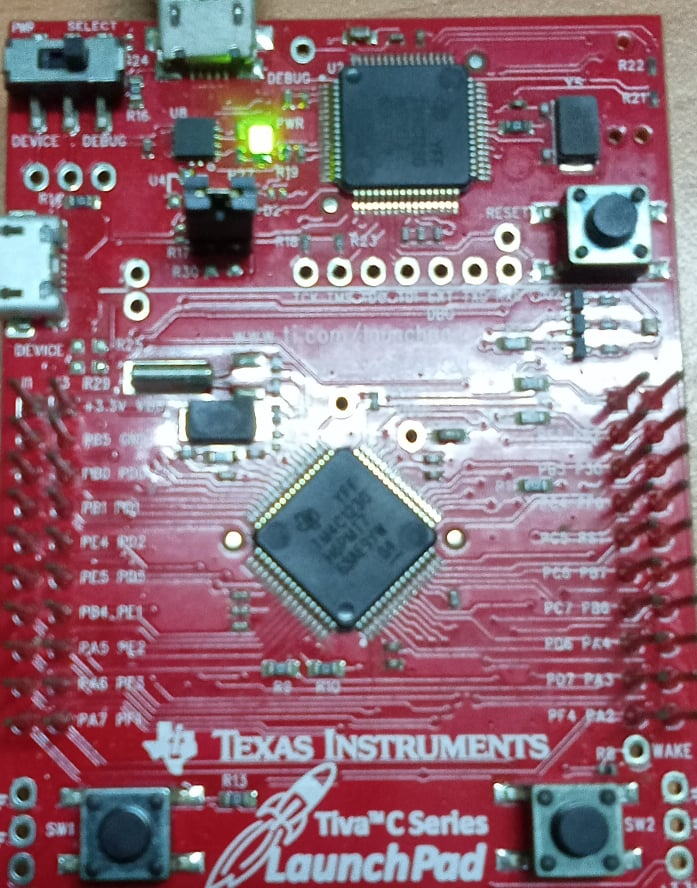
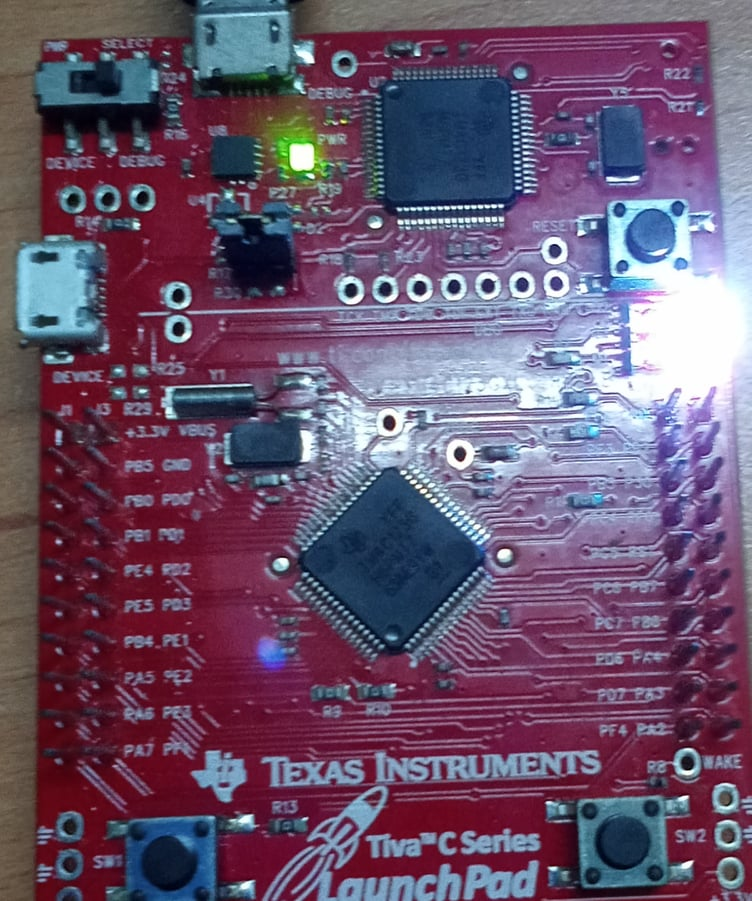

<!-- PROJECT LOGO -->
<br />
<p align="center">
  <h1 align="center">Binary Semaphore Interrupt Synchronization</h1>
  
  

<!-- TABLE OF CONTENTS -->
<details open="open">
  <summary>Table of Contents</summary>
  <ol>
    <li>
      <a href="#about-the-project">About The Project</a>
      <ul>
        <li><a href="#overview">Overview</a></li>
		<li><a href="#expected-behavior">Expected Behavior</a></li>
		<li><a href="#project-structure">Project Structure</a></li>
      </ul>
    </li>
	<li><a href="#comments">Comments</a></li>
    <li><a href="#contact">Contact</a></li>
    <li><a href="#references">References</a></li>
  </ol>
</details>


<!-- ABOUT THE PROJECT -->
## About The Project

This project is built on the EK-TM4C123GXL development board.

### Overview

The project create two tasks and an external interrupt on switch 1 to synchronize these tasks using binary semaphore. These two tasks control an group LED (Red - Blue - Green LEDs). “LEDsOn” task turns on LEDs. Similarly, “LEDsOff” turns off LEDs.<br>

Both these tasks have the same priority and use the same binary semaphore. After the scheduler starts, both tasks remain in a blocking state unless interrupt occurs and it gives binary semaphore by xSemaphoreGiveFromISR() function. Because equal priority tasks follow a time-sharing scheduling algorithm in FreeRTOS. In response, both tasks will acquire binary semaphore turn by turn.<br>

### Expected Behavior
<p>
Both tasks fall into block state and only after button is pressed and binary semaphore will be given (initially when binary semaphore is generated it will be in indeterminate state). Tasks will take turns receiving the binary semaphore and executing
<p align="center">
  
  
</p>


### Project Structure

```
├── README.md              			: Description of project
├── images              			: Folder contains images of project
      ├── LEDOn.jpg
      ├── LEDOff.jpg
├── FreeRTOS					: Folder contains FreeRTOS Library
      ├── License
      ├── Source
├── tm4c_lib					: TM4C123G Library GPIO, NVIC, Phase locked loop
      ├── tm4c123gh6pm.h
      ├── tm4c_lib.h
      ├── tm4c_gpio.h
      ├── tm4c_gpio.c
      ├── tm4c_nvic.h
      ├── tm4c_nvic.c
      ├── tm4c_pll.h
      ├── tm4c_pll.c
├── FreeRTOSConfig.h				: Define macro variables for FreeRTOS configuration
├── main.c					: Main source code
├── startup_rvmdk.S				: File startup code for TM4C123G
│   
```

<!-- GETTING STARTED -->
## Comments
In this project I'm not using the library from Texas Instrument, instead it's a library I've built with multiple references source.

<!-- CONTACT -->
## Contact

Author - [PHAM NGUYEN QUOC HUNG](https://hun9pham.github.io) - hungpham99er@gmail.com

Project Link: [Souce code](https://github.com/hun9pham/freertos-roadmap/tree/main/Project/Binary%20semaphore%20synchronous)


<!-- References -->
## References
* [TivaWare™ Peripheral Driver Library](www.ti.com/lit/ug/spmu298e/spmu298e.pdf)
* [Task Creation](https://www.freertos.org/a00019.html)
* [Task Control](https://www.freertos.org/a00112.html)
* [Semaphore / Mutexs](https://www.freertos.org/a00113.html)
