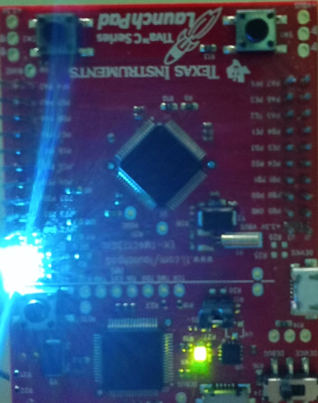
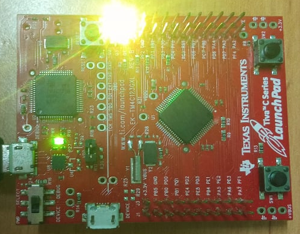

<!-- PROJECT LOGO -->
<br />
<p align="center">
  <h1 align="center">Counting event using Counting Semaphore</h1>
  
  

<!-- TABLE OF CONTENTS -->
<details open="open">
  <summary>Table of Contents</summary>
  <ol>
    <li>
      <a href="#about-the-project">About The Project</a>
      <ul>
        <li><a href="#overview">Overview</a></li>
		<li><a href="#expected-behavior">Expected Behavior</a></li>
		<li><a href="#project-structure">Project Structure</a></li>
      </ul>
    </li>
	<li><a href="#comments">Comments</a></li>
    <li><a href="#contact">Contact</a></li>
    <li><a href="#references">References</a></li>
  </ol>
</details>


<!-- ABOUT THE PROJECT -->
## About The Project

This project is built on the EK-TM4C123GXL development board.

### Overview

The project will create 3 tasks named "BlueLED", "GreenLED", "RedLED" and a Counting Semaphore with a max value of 3. Each task with its name will control different LEDs. Each task after being initialized will wait to take the Semaphore (xSemaphoreTake() function).<br>
Each time an interrupt is triggered by switch 1, a semaphore will be given and the task that received the semaphore will exit the block state and execute its job.<br>
Each time there is a change in LED state, the number of times the event (ISR) is occurred.

### Expected Behavior
<p>
After each button press, the ISR will appear and call the function xSemaphoreGiveFromISR() to give a semaphore. The task is in a block state because it is waiting for the semaphore to be unblocked and managed by its own toggle LED state. 
<p align="center">
  
  
</p>


### Project Structure

```
├── README.md              			: Description of project
├── images              			: Folder contains images of project
      ├── LEDDemo1.jpg
      ├── LEDDemo2.png
├── FreeRTOS					: Folder contains FreeRTOS Library
      ├── License
      ├── Source
├── tm4c_lib					: TM4C123G Library GPIO, NVIC, Phase locked loop
      ├── tm4c123gh6pm.h
      ├── tm4c_lib.h
      ├── tm4c_gpio.h
      ├── tm4c_gpio.c
      ├── tm4c_nvic.h
      ├── tm4c_nvic.c
      ├── tm4c_pll.h
      ├── tm4c_pll.c
├── FreeRTOSConfig.h				: Define macro variables for FreeRTOS configuration
├── main.c					: Main source code
├── startup_rvmdk.S				: File startup code for TM4C123G
│   
```

<!-- GETTING STARTED -->
## Comments
In this project I'm not using the library from Texas Instrument, instead it's a library I've built with multiple references source.

<!-- CONTACT -->
## Contact

Author - [PHAM NGUYEN QUOC HUNG](https://hun9pham.github.io) - hungpham99er@gmail.com

Project Link: [Souce code](https://github.com/hun9pham/freertos-roadmap/tree/main/Project/Couting%20event%20using%20counting%20semaphore)


<!-- References -->
## References
* [TivaWare™ Peripheral Driver Library](www.ti.com/lit/ug/spmu298e/spmu298e.pdf)
* [Task Creation](https://www.freertos.org/a00019.html)
* [Task Control](https://www.freertos.org/a00112.html)
* [Semaphore / Mutexs](https://www.freertos.org/a00113.html)
