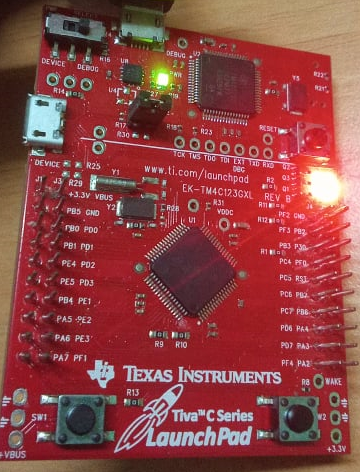
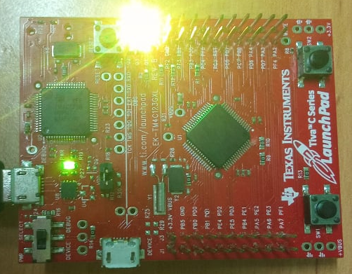
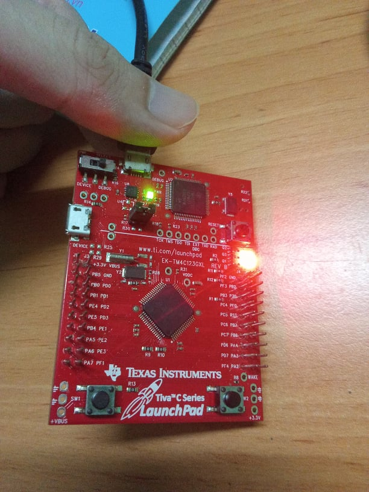

<!-- PROJECT LOGO -->
<br />
<p align="center">
  <h1 align="center">Direct to task notifications</h1>
  
  

<!-- TABLE OF CONTENTS -->
<details open="open">
  <summary>Table of Contents</summary>
  <ol>
    <li>
      <a href="#about-the-project">About The Project</a>
      <ul>
        <li><a href="#overview">Overview</a></li>
	<ul>
	  <li><a href="#wake-up-task-behavior">Wake Up Task Behavior</a></li>
	  <li><a href="#expected-behavior">Expected Behavior</a></li>
	  <li><a href="#check-notifications-received">Check Notifications Received</a></li>
	  <li><a href="#debugging-monitor">Debugging Monitor</a></li>
	</ul>
      </ul>
    </li>
	<li><a href="#comments">Comments</a></li>
    <li><a href="#contact">Contact</a></li>
    <li><a href="#references">References</a></li>
  </ol>
</details>


<!-- ABOUT THE PROJECT -->
## About The Project

This project is built on the EK-TM4C123GXL development board.

### Overview
This project consists of two section: Check Notifications Received and Wake Up Task Behavior. <br>
#### Wake Up Task Behavior
In this section, the project will simulate waking up a task from interrupt. Specifically, this task when created will be in a block state and wait for a notification to be sent from the Interrupt Service Routine. When receiving the notification, the task will leave the block state and execute its work.<br>
* Task 1 – The Wake Up Task:<br>
The wake up task is implemented by the vTaskWakeUp() function in file main. When enabling the scheduler to start with the vTaskStartScheduler() function, this task will wait for a notification by using the API function ulTaskNotifyTake().<br>
This project uses an external interrupt, specifically on port F pin 0 (Switch 1). When interrupt occurs (Switch 1 is pressed), a notification will be sent to the task to wake up this task. When the task wakes up, the green LED will blink with a period of 300ms.<br>
* Task 2 – The Task Idle Hook<br>
An idle task hook is a function that is called during each cycle of the idle task. This task will turn on the red LED, indicating that when task 1 has not woken up, the idle task will be executed when there are no other tasks with higher priority in the ready state. The task idle hook is implemented by the vApplicationIdleHook().<br>
* Setup for this section:<br>
Make macro DEBUG_ becomes comment or deletes it at the top file after include libraries.<br>
Set macro configUSE_IDLE_HOOK in FreeRTOSConfig.h to 1.<br>

#### Expected Behavior
<p>
When the task 1 which has higher priority than the idle task has not been woken up by the interrupt, then the idle task will take over the execution (turn on the red LED).
<p align="center">
  
</p>
When task 1 is woken up by the notification received from interrupt (switch 1 is pressed), now task 1 will start executing its work (blinking the green LED).
<p align="center">
  
</p>

#### Check Notifications Received
This section consists of two tasks: Task sends notifications and Task receives notifications.<br>
* Task receives notifications - vDEBUG_TaskReceive()<br>
This task uses the API function xTaskNotifyWait() to wait for the notification to be sent from the sending task. If no notification is sent, the task will enter the block state and wait until the notification appears. This is the meaning of the 4th parameter of the xTaskNotifyWait() function (portMAX_DELAY). The notification received is stored by the ui32NotificationReceive variable.<br>
* Task sends notifications - vDEBUG_TaskSend()<br>
This task uses API functions xTaskNotifyGive() and xTaskNotify respectively with different parameters.<br>

The purpose of this section is added to better understand about the types of notification that the task receives.<br>
* Setup for this section:<br>
Define macro DEBUG_ (#define DEBUG_) at the top file after include libraries.<br>
Set macro configUSE_IDLE_HOOK in FreeRTOSConfig.h to 0.<br>
#### Debugging Monitor
<p>
Task sends a notification by using xTaskNotifyGive(). More about [xTaskNotifyGive](https://www.freertos.org/xTaskNotifyGive.html)
<p align="center">
  
</p>
The queue send software timer has a period of two seconds, and is reset each time SW1 is pressed.  So if two seconds expire without SW1 being
pressed then the queue receive task will blink the red LED indicating that data was received on the queue from the queue send software timer.
<p align="center">
  
</p>


### Project Structure

```
├── README.md              			: Description of project
├── images              			: Folder contains images of project
      ├── BlueLED.jpg
      ├── BlueGreenLED.jpg
├── driverlib         				: Folder contains TivaWare™ Peripheral Driver Library
      ├── other peripherals library files
├── inc						: Folder contains TivaWare™ Peripheral Driver Library
      ├── other header files
├── FreeRTOS					: Folder contains FreeRTOS Library
      ├── Source
├── FreeRTOSConfig.h				: Define macro variables for FreeRTOS configuration
├── hardware_config.h				: This file configs three LEDs on board, enable the PLL and initialize the bus frequency to 80MHz
├── hardware_config.c				: Define functions in hardware_config.h
├── main.c					: Main source code
├── startup_rvmdk.S				: File startup code for TM4C123G
```

<!-- GETTING STARTED -->
## Comments
In addition to the FreeRTOS API functions, a peripheral driver library from TI is used in this example.

<!-- CONTACT -->
## Contact

Author - [PHAM NGUYEN QUOC HUNG](https://hun9pham.github.io) - hungpham99er@gmail.com

Project Link: [Souce code](https://github.com/hun9pham/freertos-roadmap/tree/main/Project/Direct%20to%20task%20notifications)


<!-- References -->
## References
* [TivaWare™ Peripheral Driver Library](www.ti.com/lit/ug/spmu298e/spmu298e.pdf)
* [Task Creation](https://www.freertos.org/a00019.html)
* [Task Control](https://www.freertos.org/a00112.html)
* [Task Utilities](https://www.freertos.org/a00021.html)
* [RTOS Task Notifications](https://www.freertos.org/RTOS-task-notification-API.html)
* [The Task Idle Hook](https://www.freertos.org/RTOS-idle-task.html)

