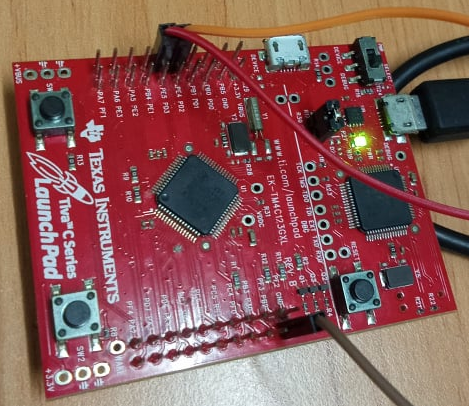
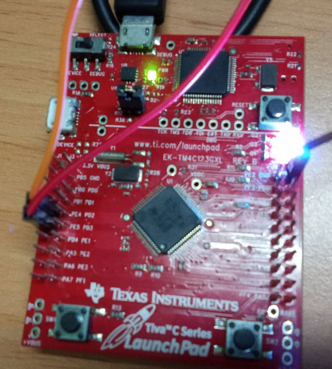

<!-- PROJECT LOGO -->
<br />
<p align="center">
  <h1 align="center">Event groups Synchronous tasks</h1>
  
  

<!-- TABLE OF CONTENTS -->
<details open="open">
  <summary>Table of Contents</summary>
  <ol>
    <li>
      <a href="#about-the-project">About The Project</a>
      <ul>
        <li><a href="#overview">Overview</a></li>
		<li><a href="#expected-behavior">Expected Behavior</a></li>
		<li><a href="#project-structure">Project Structure</a></li>
      </ul>
    </li>
	<li><a href="#comments">Comments</a></li>
    <li><a href="#contact">Contact</a></li>
    <li><a href="#references">References</a></li>
  </ol>
</details>


<!-- ABOUT THE PROJECT -->
## About The Project

This project is built on the EK-TM4C123GXL development board.

### Overview

The program will create 4 tasks, in which 3 tasks named "Red", "Blue", "Green" will control 3 LEDs respectively, task "Rendezvous" will check the event bits in the event group To perform synchronously turn on all 3 LEDs.<br>
* vTask_RedLED - vTask_RedLED - vTask_RedLED <br>
Set the corresponding event bits of the task itself when it hijacks execution.<br>
* vTask_PointMeeting <br>
Wait for the event bits in the event group to be considered to do their job.<br>

### Expected Behavior
<p>
Three LEDs will blink after alternately.<br>
<p align="center">
  
  
</p>


### Project Structure

```
├── README.md              			: Description of project
├── images              			: Folder contains images of project
      ├── LEDOn.jpg
      ├── LEDOff.png
├── FreeRTOS					: Folder contains FreeRTOS Library
      ├── License
      ├── Source
├── tm4c_lib					: TM4C123G Library GPIO, NVIC, Phase locked loop
      ├── tm4c123gh6pm.h
      ├── tm4c_lib.h
      ├── tm4c_gpio.h
      ├── tm4c_gpio.c
      ├── tm4c_nvic.h
      ├── tm4c_nvic.c
      ├── tm4c_pll.h
      ├── tm4c_pll.c
      ├── tm4c_uart.h
      ├── tm4c_uart.c
├── FreeRTOSConfig.h				: Define macro variables for FreeRTOS configuration
├── main.c					: Main source code
├── startup_rvmdk.S				: File startup code for TM4C123G
│   
```

<!-- GETTING STARTED -->
## Comments
In this project I'm not using the library from Texas Instrument, instead it's a library I've built with multiple references source.

<!-- CONTACT -->
## Contact

Author - [PHAM NGUYEN QUOC HUNG](https://hun9pham.github.io) - hungpham99er@gmail.com

Project Link: [Souce code](https://github.com/hun9pham/freertos-roadmap/tree/main/Project/Event%20groups%20Synchronous%20tasks)


<!-- References -->
## References
* [TivaWare™ Peripheral Driver Library](www.ti.com/lit/ug/spmu298e/spmu298e.pdf)
* [Task Creation](https://www.freertos.org/a00019.html)
* [Task Control](https://www.freertos.org/a00112.html)
* [Event Groups](https://www.freertos.org/FreeRTOS-Event-Groups.html)
