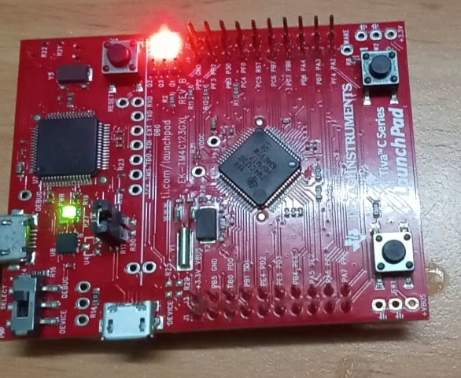
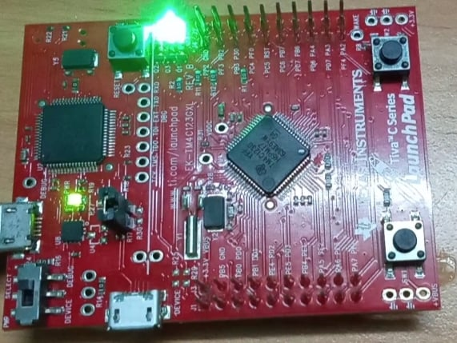

<!-- PROJECT LOGO -->
<br />
<p align="center">
  <h1 align="center">InterTask comunication using Queues</h1>
  
  

<!-- TABLE OF CONTENTS -->
<details open="open">
  <summary>Table of Contents</summary>
  <ol>
    <li>
      <a href="#about-the-project">About The Project</a>
      <ul>
        <li><a href="#overview">Overview</a></li>
		<li><a href="#expected-behavior">Expected Behavior</a></li>
		<li><a href="#project-structure">Project Structure</a></li>
      </ul>
    </li>
	<li><a href="#comments">Comments</a></li>
    <li><a href="#contact">Contact</a></li>
    <li><a href="#references">References</a></li>
  </ol>
</details>


<!-- ABOUT THE PROJECT -->
## About The Project

This project is built on the EK-TM4C123GXL development board.

### Overview
This project uses FreeRTOS's AIP function to create two task to be described below. After starts the scheduler, the context switching between two task begin. To serve the communication between 2 tasks, one queue has named " MessageQueue " was created through the API function from FreeRTOS library xQueueCreate() with the purpose of sending message from task 2 and receiving message from task 1.  
This example uses heap_1 because no task will be deleted.
* MessageQueue <br>
g_xMessageQueue is a global variable representing MessageQueue mention above, which will store messages from task 2 sent to. Task 1 can receive messages from g_xMessageQueue. Thus, the communication between the two tasks has been formed.
* Task 1 - Receiver Message Task <br>
The receiver message task is implemented by the void vTask_Receiver() function in file main. This task will always wait for the available items (MessageQueue is not empty) in MessageQueue, the variable uxMessageExist indicates the number of messages that exist in MessageQueue. The message is received by copy through BaseType_t xQueueReceive() function, which is stored by the variable has named cLetterReceiv. With each cLetterReceiv, task will execute different LEDs flash, specifically three LEDs on board. 
Execution for message received:
' R ' - Red LED on, blue and green off.
' B ' - Blue LED on, red and green off.
' G ' - Green LED on, blue and red off.
After the execution, task will be blocked by void vTaskDelay(xDelay) function with xDelay is the amount of time wanted.
* Task 2 - Sender Message Task <br>
The sender message task is implemented by the void vTask_Sender() function in file main. When MessageQueue is not full, this task will send a message to the MessageQueue through BaseType_t xQueueSendToBack() function. In this task, void vTaskDelay() is not used because  BaseType_t xQueueSendToBack() function will block this task when MessageQueue was full. Otherwise, when MessageQueue becomes available, task 2 also cannot occupy task 1's execution to send messages to the MessageQueue because task 1's priority is higher than task 2's. Only when task 1 is blocked, task 2 can countinue to send messages to the MessageQueue. 

### Expected Behavior
<p>
Corresponding to the characters 'R', 'B', 'G' in the MessageQueue, the red-blue-green LEDs will alternately turn on.
<p align="center">
  
  
  
</p>


### Project Structure

```
├── README.md              			: Description of project
├── images              			: Folder contains images of project
      ├── BlueLED.jpg
      ├── BlueGreenLED.jpg
├── driverlib         				: Folder contains TivaWare™ Peripheral Driver Library
      ├── other peripherals library files
├── inc						: Folder contains TivaWare™ Peripheral Driver Library
      ├── other header files
├── FreeRTOS					: Folder contains FreeRTOS Library
      ├── License
      ├── Source
├── FreeRTOSConfig.h				: Define macro variables for FreeRTOS configuration
├── delay.h					: Two functions delay in miliseconds and microseconds are declared in this file
├── delay.c					: Define functions in delay.h
├── hardware_config.h				: This file configs three LEDs on board, enable the PLL and initialize the bus frequency to 80MHz
├── hardware_config.c				: Define functions in hardware_config.h
├── main.c					: Main source code
├── startup_rvmdk.S				: File startup code for TM4C123G
│   
```

<!-- GETTING STARTED -->
## Comments
In addition to the FreeRTOS API functions, a peripheral driver library from TI is used in this example.

<!-- CONTACT -->
## Contact

Author - [PHAM NGUYEN QUOC HUNG](https://hun9pham.github.io) - hungpham99er@gmail.com

Project Link: [Souce code](https://github.com/hun9pham/freertos-work/tree/main/Project/InterTask%20comunication%20using%20Queues%20(non%20-%20ISR))


<!-- References -->
## References
* [TivaWare™ Peripheral Driver Library](www.ti.com/lit/ug/spmu298e/spmu298e.pdf)
* [Task Creation](https://www.freertos.org/a00019.html)
* [Task Control](https://www.freertos.org/a00112.html)
* [Task Utilities](https://www.freertos.org/a00021.html)
* [Queue Management](https://www.freertos.org/a00018.html)
