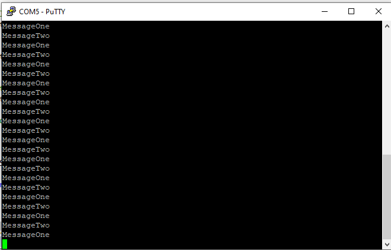

<!-- PROJECT LOGO -->
<br />
<p align="center">
  <h1 align="center">Accessing to share resource using Mutex</h1>
  
  

<!-- TABLE OF CONTENTS -->
<details open="open">
  <summary>Table of Contents</summary>
  <ol>
    <li>
      <a href="#about-the-project">About The Project</a>
      <ul>
        <li><a href="#overview">Overview</a></li>
		<li><a href="#expected-behavior">Expected Behavior</a></li>
		<li><a href="#project-structure">Project Structure</a></li>
      </ul>
    </li>
	<li><a href="#comments">Comments</a></li>
    <li><a href="#contact">Contact</a></li>
    <li><a href="#references">References</a></li>
  </ol>
</details>


<!-- ABOUT THE PROJECT -->
## About The Project

This project is built on the EK-TM4C123GXL development board.

### Overview

This project describes accessing the shared resource between "MsgOne" task and "MsgTwo" task by using Mutex to avoid race condition. Shared Resource here is an array of characters. Depending on the task, it will have its own Message and be passed to the shared resource.<br><br>
The project uses the UART5 module to communicate with the computer and uses the PuTTY software to display and receive data sent from the UART5 on the console.<br>
<br>
USB TTL CP2102 and Kit tiva C connection:


| EK-TM4C123GXL  |USB TTL CP2102		|
|----------------|-------------------------------|
|PE4      | Tx|
|PE5 	 | Rx| 
|GND   | GND   | 
<br>
PuTTY's interface. (References [UART Communication TM4C123 Tiva C LaunchPad](https://microcontrollerslab.com/uart-communication-tm4c123-tiva-c-launchpad/))
<p>

<p>

### Expected Behavior
<p>
message from task "MsgOne" and "MsgTwo" sent respectively without race condition problem when accessing to shared resource.<br>
<p align="center">
  
  
</p>


### Project Structure

```
├── README.md              			: Description of project
├── images              			: Folder contains images of project
      ├── uart5.png
├── FreeRTOS					: Folder contains FreeRTOS Library
      ├── License
      ├── Source
├── tm4c_lib					: TM4C123G Library GPIO, NVIC, Phase locked loop
      ├── tm4c123gh6pm.h
      ├── tm4c_lib.h
      ├── tm4c_gpio.h
      ├── tm4c_gpio.c
      ├── tm4c_nvic.h
      ├── tm4c_nvic.c
      ├── tm4c_pll.h
      ├── tm4c_pll.c
      ├── tm4c_uart.h
      ├── tm4c_uart.c
├── FreeRTOSConfig.h				: Define macro variables for FreeRTOS configuration
├── main.c					: Main source code
├── startup_rvmdk.S				: File startup code for TM4C123G
│   
```

<!-- GETTING STARTED -->
## Comments
In this project I'm not using the library from Texas Instrument, instead it's a library I've built with multiple references source.

<!-- CONTACT -->
## Contact

Author - [PHAM NGUYEN QUOC HUNG](https://hun9pham.github.io) - hungpham99er@gmail.com

Project Link: [Souce code](https://github.com/hun9pham/freertos-roadmap/tree/main/Project/Mutex%20accessing%20share%20resource)


<!-- References -->
## References
* [TivaWare™ Peripheral Driver Library](www.ti.com/lit/ug/spmu298e/spmu298e.pdf)
* [Task Creation](https://www.freertos.org/a00019.html)
* [Task Control](https://www.freertos.org/a00112.html)
* [Semaphore / Mutex](https://www.freertos.org/a00113.html)
* [PuTTY](https://www.putty.org)
* [UART Communication TM4C123 Tiva C LaunchPad](https://microcontrollerslab.com/uart-communication-tm4c123-tiva-c-launchpad/)
