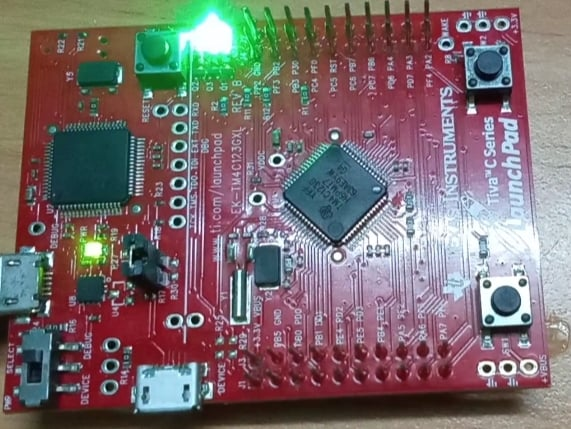
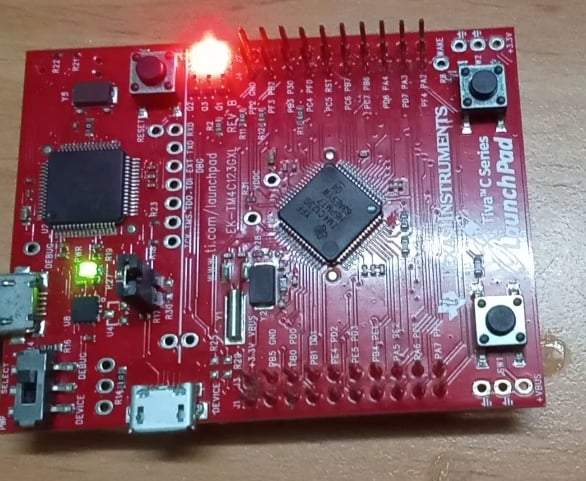

<!-- PROJECT LOGO -->
<br />
<p align="center">
  <h1 align="center">Software Timer type one - shot</h1>
  
  

<!-- TABLE OF CONTENTS -->
<details open="open">
  <summary>Table of Contents</summary>
  <ol>
    <li>
      <a href="#about-the-project">About The Project</a>
      <ul>
        <li><a href="#overview">Overview</a></li>
		<li><a href="#expected-behavior">Expected Behavior</a></li>
		<li><a href="#project-structure">Project Structure</a></li>
      </ul>
    </li>
	<li><a href="#comments">Comments</a></li>
    <li><a href="#contact">Contact</a></li>
    <li><a href="#references">References</a></li>
  </ol>
</details>


<!-- ABOUT THE PROJECT -->
## About The Project

This project is built on the EK-TM4C123GXL development board.

### Overview
This project uses FreeRTOS's AIP function to create two task, one software timer, one queue. It then starts the scheduler.
* Task 1 - The Queue Send Task<br>
The queue send task is implemented by the QueueSendTask() function in this file.  It uses vTaskDelayUntil() to create a periodic task that sends the value 100 to the queue every 200 milliseconds.<br>
Software timer callback function - The Queue Send Software Timer:
The timer is a one - shot timer that is reset by a SW1 press. The timer's period is set to two seconds - if the timer expires then its callback function writes the value 200 to the queue.  The callback function is implemented by QueueSendTimerCallback() within this file.
When SW1 is pressed, the interrupt on GPIOF pin 0 will occur and the handle function for this interrupt has named SwitchHandler().<br>
* Task 2 - The Queue Receive Task<br>
The queue receive task is implemented by the QueueReceiveTask() function in this file.  QueueReceiveTask() waits for data to arrive on the queue.
When data is received, the task checks the value of the data, then blinks the green LED to indicate that the data came from task 1 and the red LED to indicate that it came from the queue send software timer.

### Expected Behavior
<p>
The queue send task writes to the queue every 200ms, so every 200ms the queue receive task will blink the green LED indicating that data was received on the queue from the queue send task.
<p align="center">
  
</p>
The queue send software timer has a period of two seconds, and is reset each time SW1 is pressed.  So if two seconds expire without SW1 being
pressed then the queue receive task will blink the red LED indicating that data was received on the queue from the queue send software timer.
<p align="center">
  
</p>


### Project Structure

```
├── README.md              			: Description of project
├── images              			: Folder contains images of project
      ├── BlueLED.jpg
      ├── BlueGreenLED.jpg
├── driverlib         				: Folder contains TivaWare™ Peripheral Driver Library
      ├── other peripherals library files
├── inc						: Folder contains TivaWare™ Peripheral Driver Library
      ├── other header files
├── FreeRTOS					: Folder contains FreeRTOS Library
      ├── Source
├── FreeRTOSConfig.h				: Define macro variables for FreeRTOS configuration
├── hardware_config.h				: This file configs three LEDs on board, enable the PLL and initialize the bus frequency to 80MHz
├── hardware_config.c				: Define functions in hardware_config.h
├── main.c					: Main source code
├── startup_rvmdk.S				: File startup code for TM4C123G
```

<!-- GETTING STARTED -->
## Comments
In addition to the FreeRTOS API functions, a peripheral driver library from TI is used in this example.

<!-- CONTACT -->
## Contact

Author - [PHAM NGUYEN QUOC HUNG](https://hun9pham.github.io) - hungpham99er@gmail.com

Project Link: [Souce code](https://github.com/hun9pham/freertos-work/tree/main/Project/Software%20Timer%20type%20one%20-%20shot)


<!-- References -->
## References
* [TivaWare™ Peripheral Driver Library](www.ti.com/lit/ug/spmu298e/spmu298e.pdf)
* [Task Creation](https://www.freertos.org/a00019.html)
* [Task Control](https://www.freertos.org/a00112.html)
* [Task Utilities](https://www.freertos.org/a00021.html)
* [Queue Management](https://www.freertos.org/a00018.html)
* [Software Timer](https://www.freertos.org/FreeRTOS-Software-Timer-API-Functions.html)
