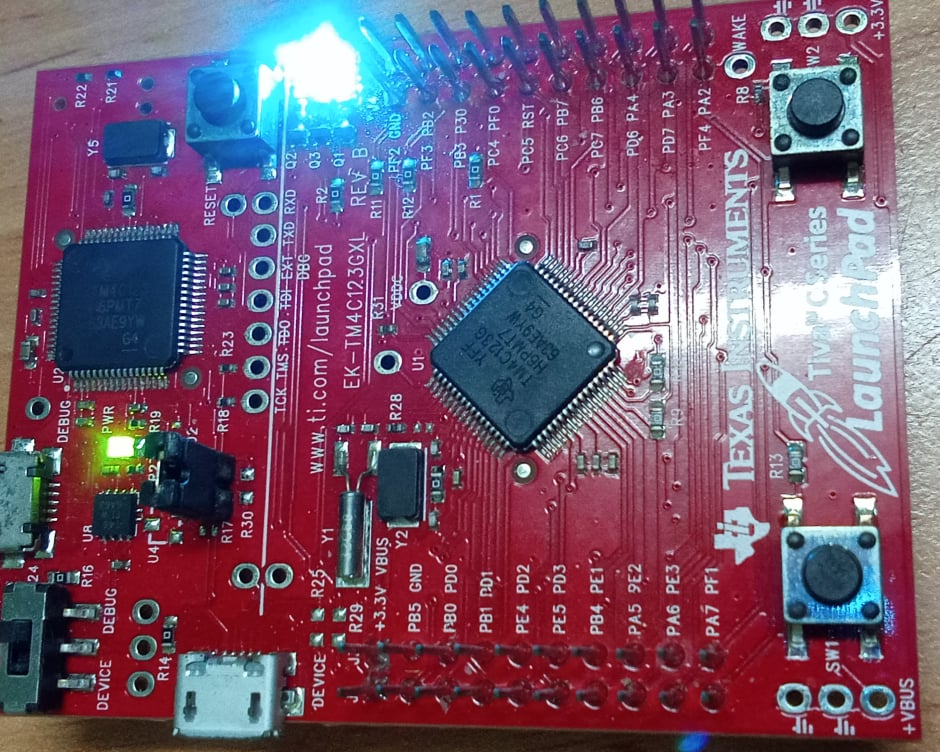
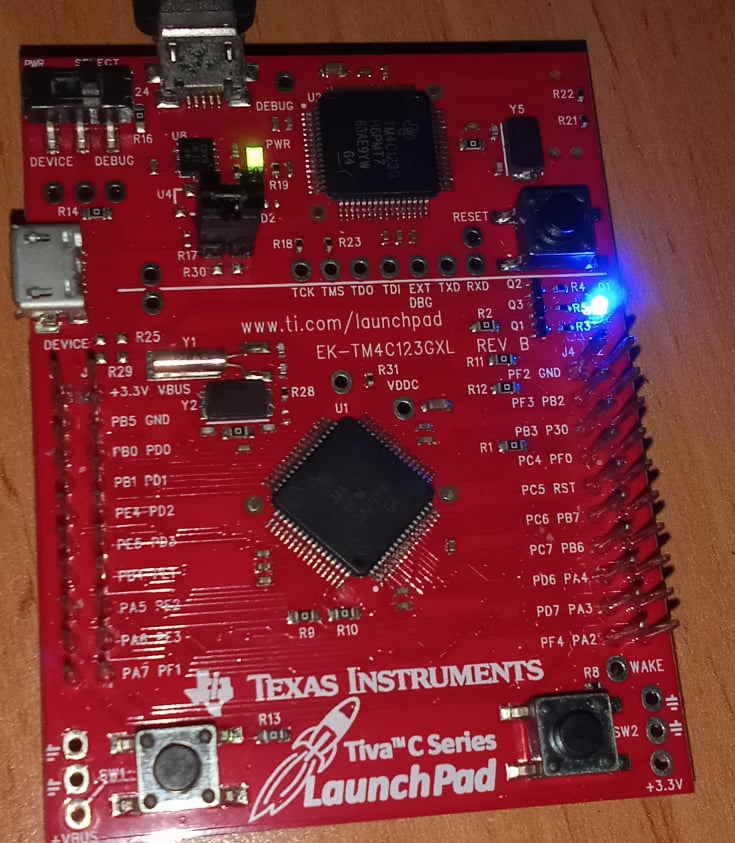

<!-- PROJECT LOGO -->
<br />
<p align="center">
  <h1 align="center">Task manipulation</h1>
  
  

<!-- TABLE OF CONTENTS -->
<details open="open">
  <summary>Table of Contents</summary>
  <ol>
    <li>
      <a href="#about-the-project">About The Project</a>
      <ul>
        <li><a href="#overview">Overview</a></li>
		<li><a href="#expected-behavior">Expected Behavior</a></li>
		<li><a href="#project-structure">Project Structure</a></li>
      </ul>
    </li>
	<li><a href="#comments">Comments</a></li>
    <li><a href="#contact">Contact</a></li>
    <li><a href="#references">References</a></li>
  </ol>
</details>


<!-- ABOUT THE PROJECT -->
## About The Project

This project is built on the EK-TM4C123GXL development board.

### Overview

This project uses FreeRTOS's AIP function to create two task and be described below. After starts the scheduler, the context switching between two task begin. This example uses heap_2 supporting for delete a task.
* Task 1 - Blue Led Blinky <br>
The blue LED blinky is implemented by the void vTask_BlueBlinky() function in file main. It uses vTaskDelayUntil() to create a periodic task and increase the counter variable named g_ui32Counter after two vTaskDelayUntil() function called. At the first time, when counter variable reaches 10 ticks, task 2 will be delete by vTaskDelete() function. After that, every count to 5 ticks by counter variable, task 2 will be created and deleted periodically.
* Task 2 - Green Led Blinky <br>
The green LED blinky is implemented by the void vTask_GreenBlinky() function in file main. This task have priority lower than task 1 and it will blink green LED periodically.

### Expected Behavior
<p>
First, two LED green and blue blinks together.
<p align="center">
  
</p>
After first 10 tick counts, only just LED blue blinks, and then after every 5 tick counts green blinking tasks will be created and deleted alternately.
<p align="center">
  
</p>

### Project Structure

```
├── README.md              			: Description of project
├── images              			: Folder contains images of project
      ├── BlueLED.jpg
      ├── BlueGreenLED.jpg
├── driverlib         				: Folder contains TivaWare™ Peripheral Driver Library
      ├── other peripherals library files
├── inc						: Folder contains TivaWare™ Peripheral Driver Library
      ├── other header files
├── FreeRTOS					: Folder contains FreeRTOS Library
      ├── License
      ├── Source
├── FreeRTOSConfig.h				: Define macro variables for FreeRTOS configuration
├── delay.h					: Two functions delay in miliseconds and microseconds are declared in this file
├── delay.c					: Define functions in delay.h
├── hardware_config.h				: This file configs three LEDs on board, enable the PLL and initialize the bus frequency to 80MHz
├── hardware_config.c				: Define functions in hardware_config.h
├── main.c					: Main source code
├── startup_rvmdk.S				: File startup code for TM4C123G
│   
```

<!-- GETTING STARTED -->
## Comments
In addition to the FreeRTOS API functions, a peripheral driver library from TI is used in this example.

<!-- CONTACT -->
## Contact

Author - [PHAM NGUYEN QUOC HUNG](https://hun9pham.github.io) - hungpham99er@gmail.com

Project Link: [Souce code](https://github.com/hun9pham/freertos-work/tree/main/Project/Task%20manipulation)


<!-- References -->
## References
* [TivaWare™ Peripheral Driver Library](www.ti.com/lit/ug/spmu298e/spmu298e.pdf)
* [Task Creation](https://www.freertos.org/a00019.html)
* [Task Control](https://www.freertos.org/a00112.html)
* [Task Utilities](https://www.freertos.org/a00021.html)
