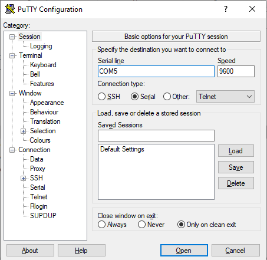
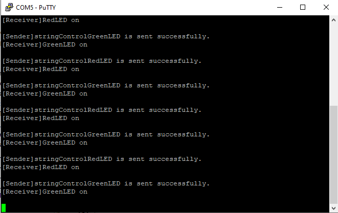
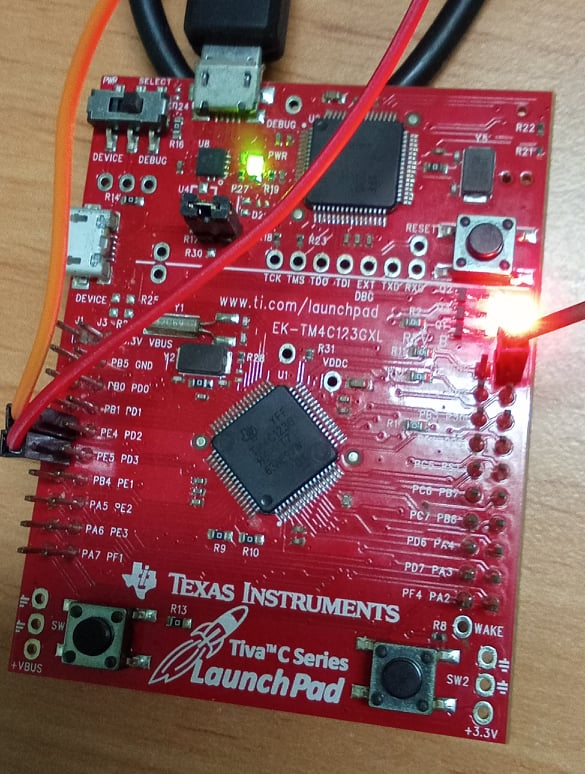
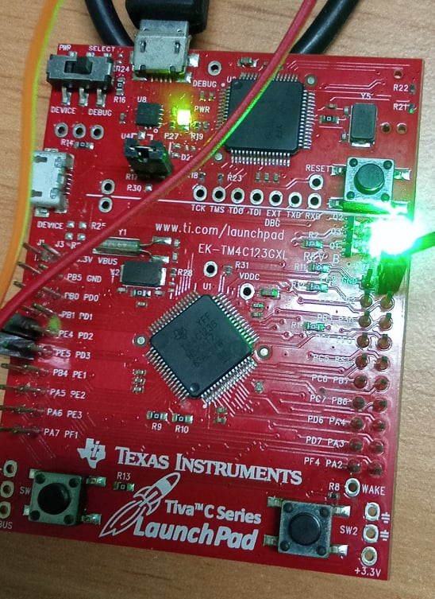

<!-- PROJECT LOGO -->
<br />
<p align="center">
  <h1 align="center">Tasks 's Communication via StreamBuffer</h1>
  
  

<!-- TABLE OF CONTENTS -->
<details open="open">
  <summary>Table of Contents</summary>
  <ol>
    <li>
      <a href="#about-the-project">About The Project</a>
      <ul>
        <li><a href="#overview">Overview</a></li>
		<li><a href="#expected-behavior">Expected Behavior</a></li>
		<li><a href="#project-structure">Project Structure</a></li>
      </ul>
    </li>
	<li><a href="#comments">Comments</a></li>
    <li><a href="#contact">Contact</a></li>
    <li><a href="#references">References</a></li>
  </ol>
</details>


<!-- ABOUT THE PROJECT -->
## About The Project

This project is built on the EK-TM4C123GXL development board.

### Overview

This project performs the transmission and reception of data bytes from 2 tasks "Sender" and "Receiver". The data bytes will be stored using the stream buffer object, for the purpose of communication between the two tasks.<br>
* Task 1 - vTask_Sender<br>
Check the Stream Buffer. If space of Stream Buffer is available, it will send data bytes (message) in turn to control two green and red LEDs and print a monitor message.<br>
* Task 2 - vTask_Receiver<br>
Receive the corresponding messages from the Stream Buffer and control the LEDs, and print the corresponding message when it was sent. <br>
<br>
The project uses the UART5 module to communicate with the computer and uses the PuTTY software to display and receive data sent from the UART5 on the console.<br>
<br>
USB TTL CP2102 and Kit tiva C connection:


| EK-TM4C123GXL  |USB TTL CP2102		|
|----------------|-------------------------------|
|PE4      | Tx|
|PE5 	 | Rx| 
|GND   | GND   | 
<br>
PuTTY's interface (Link references UART Communication TM4C123 Tiva C LaunchPad below).
<p align = "center">

<p>

### Expected Behavior
<p>
Red LED and Green LED will blink alternatively corresponding to message coming.<br>
<p align="center">
  
  
  
</p>


### Project Structure

```
├── README.md              			: Description of project
├── images              			: Folder contains images of project
      ├── GreenLED.jpg
      ├── RedLED.jpg
      ├── MonitorUAR.png
├── FreeRTOS					: Folder contains FreeRTOS Library
      ├── License
      ├── Source
├── tm4c_lib					: TM4C123G Library GPIO, NVIC, Phase locked loop
      ├── tm4c123gh6pm.h
      ├── tm4c_lib.h
      ├── tm4c_gpio.h
      ├── tm4c_gpio.c
      ├── tm4c_nvic.h
      ├── tm4c_nvic.c
      ├── tm4c_pll.h
      ├── tm4c_pll.c
      ├── tm4c_uart.h
      ├── tm4c_uart.c
├── FreeRTOSConfig.h				: Define macro variables for FreeRTOS configuration
├── main.c					: Main source code
├── startup_rvmdk.S				: File startup code for TM4C123G
│   
```

<!-- GETTING STARTED -->
## Comments
In this project I'm not using the library from Texas Instrument, instead it's a library I've built with multiple references source.

<!-- CONTACT -->
## Contact

Author - [PHAM NGUYEN QUOC HUNG](https://hun9pham.github.io) - hungpham99er@gmail.com

Project Link: [Souce code](https://github.com/hun9pham/freertos-roadmap/tree/main/Project/StreamBuffer%20communication)


<!-- References -->
## References
* [TivaWare™ Peripheral Driver Library](www.ti.com/lit/ug/spmu298e/spmu298e.pdf)
* [Task Creation](https://www.freertos.org/a00019.html)
* [Task Control](https://www.freertos.org/a00112.html)
* [Stream Buffer](https://www.freertos.org/RTOS-stream-buffer-example.html)
* [PuTTY](https://www.putty.org)
* [UART Communication TM4C123 Tiva C LaunchPad](https://microcontrollerslab.com/uart-communication-tm4c123-tiva-c-launchpad/)
